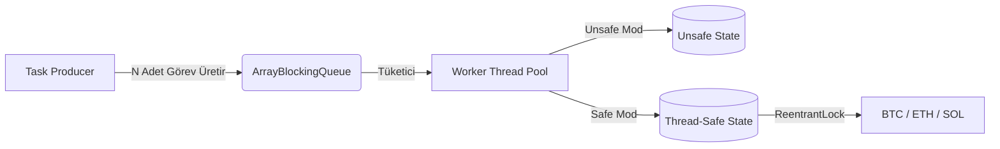

<div align="center">
  <h1>🚀 Kripto Fiyat Simülatörü (Crypto Price Simulator)</h1>
  <p>
    <strong>İleri düzey Java Eşzamanlılık (Concurrency) yeteneklerini göstermek üzere tasarlanmış, bellek içi yüksek performanslı kripto para fiyat simülasyon motoru.</strong>
  </p>
  <p>
    
    
    
    
  </p>
</div>

<hr />

##  İçindekiler
- [Proje Hakkında](#-proje-hakkında)
- [Öne Çıkan Özellikler](#-öne-çıkan-özellikler)
- [Mimari ve Tasarım](#-mimari-ve-tasarım)
- [Başlarken](#-başlarken)
- [API Dokümantasyonu](#-api-dokümantasyonu)
- [Test ve Performans (Benchmark)](#-test-ve-performans-benchmark)
- [Grup Üyeleri](#-grup-üyeleri)

##  Proje Hakkında

**Kripto Fiyat Simülatörü**, saf bellek içi (in-memory) bir ortamda binlerce yüksek frekanslı kripto para (BTC, ETH, SOL) fiyat güncellemesini işlemek üzere tasarlanmış özel, çok iş parçacıklı (multi-threaded) bir motordur.

Bu projenin temel amacı, **Java Concurrency** (Eşzamanlılık) mekanizmalarını canlı olarak sergilemektir. Kontrolsüz iş parçacığı erişiminin tehlikelerini (Race Conditions & Lost Updates) uygulamalı olarak gösterir ve bunları `ReentrantLock` ve `AtomicLong` kullanan güçlü, thread-safe (iş parçacığı güvenli) çözümlerle karşılaştırır.

##  Öne Çıkan Özellikler

- **Yüksek Verimli Simülasyon Motoru:** Sınırlı kapasiteli `ArrayBlockingQueue` ve `FixedThreadPool` kullanarak saniyede milyonlarca görevi işleyebilir.
- **Thread-Safety Kanıtı:** Invariant (matematiksel değişmezlik) durumunu kanıtlamak için `Unsafe` (race condition'a açık) ve `Safe` (tam senkronize) durumların yan yana çalıştırılması.
- **Java 21 Virtual Threads (Bonus):** CPU-bound (işlemci yoğun) ve I/O-bound (giriş/çıkış yoğun) iş yükleri arasındaki performans farklarını göstermek için Project Loom'un Sanal İş Parçacıklarının sisteme yerel entegrasyonu.
- **Zarif Kapanış (Graceful Shutdown):** `CountDownLatch` ve Poison Pill desenleri ile executor yaşam döngüleri üzerinde tam kontrol.
- **RESTful API:** Simülasyonları tetiklemek ve değişmez (immutable) anlık sonuçları (snapshot) getirmek için temiz, doğrulanmış uç noktalar (endpoints).

##  Mimari ve Tasarım

Simülasyon, sağlam bir Üretici-Tüketici (Producer-Consumer) mimari deseni üzerine inşa edilmiştir:



### Temel Tasarım Kararları
- **`ArrayBlockingQueue`:** Kuyruk dolduğunda üreticiye backpressure (geri baskı) uygulayarak `OutOfMemoryError` (OOM) hatalarını önler.
- **Coin Başına `ReentrantLock`:** Maksimum paralellik sağlar. BTC'yi güncellemek, ETH güncellemelerini bloke etmez.
- **`AtomicLong`:** Kilitleme maliyeti (overhead) olmadan, global sayaçlar için yüksek performanslı CAS (Compare-And-Swap) işlemleri.
- **Değiştirilemez Anlık Görüntüler (Immutable Snapshots):** REST Controller'a sunulan sonuçlar tamamen immutable'dır, böylece "dirty read" (kirli okuma) problemleri engellenir.

##  Başlarken

### Ön Koşullar
- **Java 21** veya üzeri
- **Maven 3.8+** (veya projeye dahil edilen wrapper)

### Kurulum ve Çalıştırma

1. **Repository'yi klonlayın:**
   ```bash
   git clone https://github.com/ibrahimayhann/crypto-price-simulator.git
   cd crypto-price-simulator
   ```

2. **Bütünlüğü doğrulamak için testleri çalıştırın:**
   ```bash
   mvn clean verify
   ```

3. **Uygulamayı başlatın:**
   ```bash
   mvn spring-boot:run
   ```

Uygulama `http://localhost:8080` üzerinde başlayacaktır.

##  API Dokümantasyonu

İnteraktif API dokümantasyonu Swagger UI aracılığıyla otomatik olarak oluşturulmaktadır.

- **Swagger UI:** [http://localhost:8080/swagger-ui/index.html](http://localhost:8080/swagger-ui/index.html)
- **OpenAPI JSON:** [http://localhost:8080/api-docs](http://localhost:8080/api-docs)

### Temel Endpoint'ler

| Metot | Endpoint | Açıklama |
|---|---|---|
| `POST` | `/simulate?updates=50000&workers=4` | Yeni bir simülasyon tetikler. Verimi (throughput) ve güvenlik metriklerini döner. (Zaten çalışıyorsa HTTP 409 döner). |
| `GET` | `/coins` | İzlenen tüm coinlerin mevcut durumunu ve kesin fiyatlarını getirir. |
| `GET` | `/stats` | Tamamlanan son simülasyon çalışmasının istatistiksel çıktısını getirir. |

##  Test ve Performans (Benchmark)

Proje JUnit 5 ve Spring Boot Test ile kapsamlı bir şekilde test edilmiştir.

Özel performans karşılaştırmasını (1, 2, 4, 8 Worker & Virtual Threads karşılaştırması) çalıştırmak için:
```bash
mvn "-Dbenchmark=true" "-Dtest=SimulationBenchmarkTest" test
```

> **Not:** Detaylı thread-dump analizleri, race-condition gözlem raporları ve kesin invariant kanıtları, akademik puanlama amacıyla dahili olarak `TESLIM_RAPORU.md` dosyasında belgelenmiştir.

##  Grup Üyeleri

**Binary Minds** ekibi tarafından geliştirilmiştir:
- İbrahim AYHAN (Core State & Testler)
- Fırat ASI (Engine, Queue, Benchmark)
- Ahmet KÖRELİ (API & Controller)
- Cem BORA (Ar-Ge, Dokümantasyon)
- Tolga (Mimari, Teslim Raporları)
